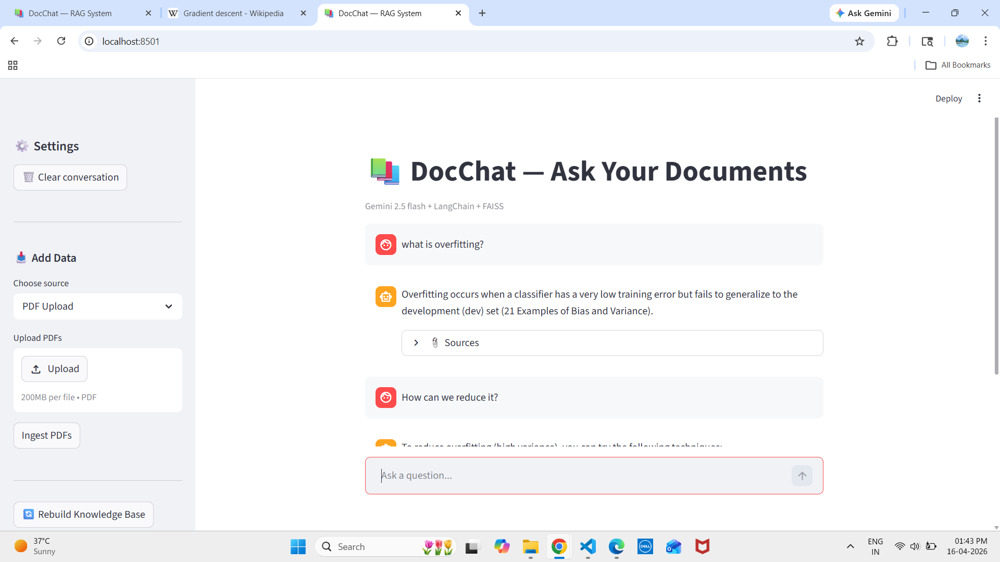

📚 DocChat — RAG-Based AI for Your Documents



An end-to-end **Retrieval-Augmented Generation (RAG)** system that allows you to chat with your documents using AI.

Built using **LangChain, FAISS, and Gemini**, this project transforms PDFs, text files, and web content into an intelligent, searchable knowledge base.

---

## 🚀 Features

- 📄 **Multi-source Ingestion**: Supports PDFs, Text files, and Web URLs.
- 🧠 **RAG Pipeline**: Efficient Chunking → Embeddings → Vector Search → LLM Response.
- 🔍 **Semantic Search with FAISS**: Fast similarity-based retrieval for high-speed performance.
- 🤖 **LLM Integration**: Powered by Google's Gemini (gemini-2.5-flash).
- 💬 **Conversational Memory**: Remembers context to handle follow-up questions seamlessly.
- 📎 **Source Citations**: Answers are grounded in retrieved document chunks for transparency.
- 🖥️ **Streamlit UI**: A clean, intuitive chat-based interface.

---

## 🧠 How It Works

1.  **Ingestion**: Documents are loaded and split into optimized smaller chunks.
2.  **Vectorization**: Each chunk is converted into high-dimensional embeddings.
3.  **Storage**: Embeddings are stored in a local FAISS vector database.
4.  **Retrieval & Generation**:
    - On a user query, the system retrieves the most relevant document chunks.
    - Context and query are sent to the LLM.
    - An answer is generated based strictly on the retrieved context.

---

## 📁 Project Structure

```text
RAG_claude/
├── app.py              # Streamlit UI
├── rag_pipeline.py     # RAG pipeline logic
├── ingestion.py        # Data processing script
├── main.py             # Entry point
├── prompts.py          # LLM prompt templates
├── config.py           # Configuration settings
├── data/               # Input source files
├── document/           # Document storage
├── vector_store/       # FAISS database (local)
├── images/             # UI screenshots
├── myenv/              # Virtual environment (ignored by git)
├── .env                # API Keys (private)
└── requirements.txt    # Project dependencies
```

## ⚙️ Setup Instructions

1. Clone the Repository
   Bash
   git clone [https://github.com/your-username/docchat.git](https://github.com/your-username/docchat.git)
   cd docchat
2. Install Dependencies
   Bash
   pip install -r requirements.txt
3. Setup Environment Variables
   Create a .env file in the root directory:

cp .env.example .env
Add your Gemini API key to the .env file:

Code snippet
GOOGLE_API_KEY=your_api_key_here

---

4. Process Your Data

Place your files (PDFs or TXT) inside the data/ folder, then run the ingestion script to build the vector database:

Bash
python ingestion.py

---

5. Launch the App
   Bash
   streamlit run app.py

---

## 🧪 Example Use Cases

Study Assistant 📚: Upload your lecture notes and quiz yourself.

Research Tool 🧠: Quickly query long research papers or journals.

Knowledge Base 🏢: Build an internal assistant for company documentation.

Web Analyzer 🌐: Provide a URL to summarize or ask questions about web content.

---
